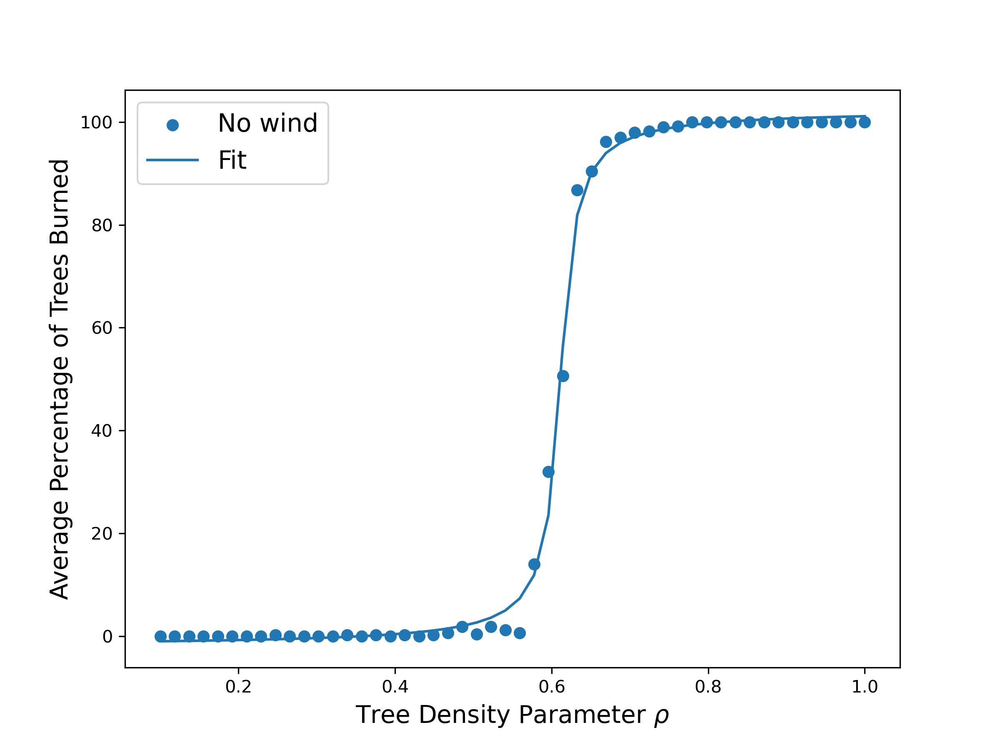
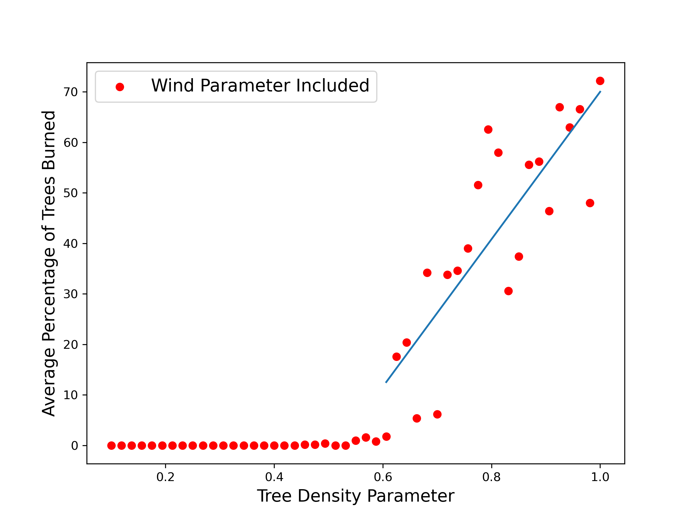

## Fire Spread Simulation

In this project, I simulated the spread of a forest fire on a 100×100 grid. Each cell in the grid can be in one of four states: tree (blue), grassland( light blue), burning tree (orange), or burnt tree (red).

The goal is to understand how forest density influences fire spread, and to explore extensions such as the effect of wind in the spread of fire in the forest.

For a tree density of $\rho = 0.7$ trees in the forest with no wind:

.gif)

For a tree density of $\rho = 0.7$ trees in the forest with wind blowing to the left:

.gif)

## A Rod-Pendulum System

Exploring a common physics problem using SymPy library.

