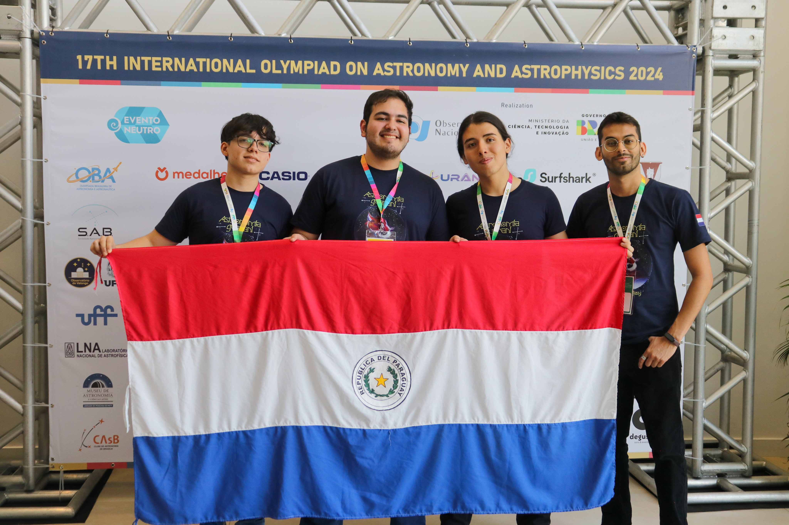

## Outreach 
* [Talk about Stellar Evolution with Ciencia del Sur: Fundamental Concepts and Current Areas of Research.](https://cienciasdelsur.com/2024/09/05/astrofisico-paraguayo-dictara-charla-gratuita-sobre-evolucion-estelar/)
* Paraguay in its first in-person participation in the International Olympiad on Astronomy and Astrophysics, which took place in Vassouras, Rio de Janeiro, Brazil, from August 17 to 27.

It was a great responsibility to be the leader of this team, which trained tirelessly since the beginning of the year for this event. The students from left to right: Renato Avalos, Kevin Aquino, and Guzman Shakur Rodriguez.

## Spotlight
* [UReCA Undergradaute Fellow - The University of Oklahoma 2023-2024](https://www.youtube.com/watch?v=ts8EwZMLLds&t=6s)
* [Texas Astronomy Undergraduate Research experience for Under-represented Students Scholar - UT Austin 2022](https://taurusastronomy.blogspot.com/2022/07/taurus-scholar-spotlight-cosme-aquino.html)
* [Interview with Ciencia del Sur ](https://cienciasdelsur.com/2018/01/27/cosme-aquino-olimpiada-astronomia-paraguay/)

